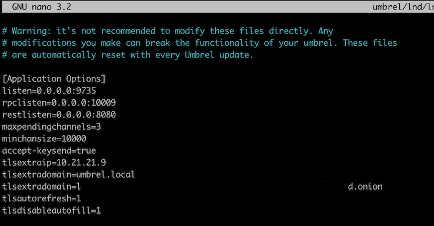

# Umbrel

## Overview

This guide will walk you through the steps required to connect your Umbrel/LND node to Wavlake. It requires a small degree of comfort with the command line and the ability to SSH into your node. We will provide code snippets where applicable to help make the process as easy as possible.

The steps below will help you 1) identify your LND's hostname and port, 2) generate/download the correct tls.cert file, and 3) generate/download a custom macaroon, all of which will give Wavlake limited permissions to create and check invoices directly on your node on your behalf. It may help to keep a notepad open while walking through this guide to copy down some of the items you will need.

## 1. Hostname and Port

In order to interact with your Umbrel, Wavlake needs a publicly accessible address to reach it. By default, Umbrel assigns the LND process an .onion hostname we can use for this purpose. If you know that your LND process is accessible via clearnet, that address or domain is OK to use, too.


The .onion address we are retrieving here is not the same .onion address used to open channels with other nodes. This .onion address applies specifically to the LND Docker process that runs on your Umbrel.


To retrieve this .onion hostname, navigate to the "Connect Wallet" section on the Umbrel homepage.


Once there, open the drop down menu and select "lndconnect gRPC Tor" from the list.


On the page, you should see a URL with a long string that ends in ".onion". Copy the all the text in between "lndconnect://" and the "?" sign.

.png>)

&#x20;You should have something copied down that looks like this:

> jfdsaoj930nglamljafafklajsdkfjdskafdsa9.onion:10009

This is your **hostname** (everything up to and including the .onion part) and **port** (the number part after the colon).

## 2. TLS Cert

The certificate file we need is automatically generated when you first start up your Umbrel and LND. However, it most likely does not contain the .onion address we will be using to connect Wavlake to you node.

In order to add the .onion host to the certificate file, we have to add one line to LND's configuration file and then restart the Umbrel so that the certificate is re-generated with the .onion hostname included.


If you have any other applications that connect to LND using the tls.cert file, you will have to reconfigure those applications with the new cert that we are generating here. The old cert will no longer be valid.


Let's start by SSH'ing into your node. Open up a terminal on your computer and run to log in:

```
ssh umbrel@umbrel.local
```

Most default setups will be accessible with the above command. If you have customized your Umbrel the command will look slightly different.

When asked for your password, enter the password for your Umbrel.

Once logged in, create a backup of your config file just in case something goes wrong. You will be able to reinstate this backup if needed.

```
cp umbrel/lnd/lnd.conf umbrel/lnd/lnd.conf-original
```

Now, let's open up the LND config file with a text editor:

```
nano umbrel/lnd/lnd.conf
```

You should see a file that looks like this:



In the example above, note the line that reads "tlsextradomain=umbrel.local". You most likely have the same line in your conf file. This setting adds the domain name listed to the tls.cert file generated by LND, making it so that any requests to LND over that hostname match the valid hostnames listed in the cert.

Using the arrow keys on your keyboard, move the cursor to this line and add a second "tlsextradomain=" line, this time adding your .onion hostname as the value. When you're done, the section should look like:

> tlsextradomain=umbrel.local
>
> tlsextradomain=jfdsaoj930nglamljafafklajsdkfjdskafdsa9.onion:10009

Be sure to spell and enter everything accurately, otherwise you may have issues with LND starting and/or capturing the new configuration.

Now that the file has been modified, save and exit by pressing CTRL-X and entering "Y" when asked if you want to save the file.


Restart your Umbrel in the "Settings" section of the Web UI.


Once your Umbrel has finished restarting, go back to your Terminal and run the following command to download the newly generated tls.cert file to your computer:

```
scp umbrel@umbrel.local:/home/umbrel/umbrel/lnd/tls.cert ./umbrel.cert
```

You will be asked for your Umbrel password again. Enter it and upon authorization your file should download to your current working directory. You can change the download path as well by modifying the "./umbrel.cert" argument.

Your cert is now ready to use.

## 3. Macaroon
