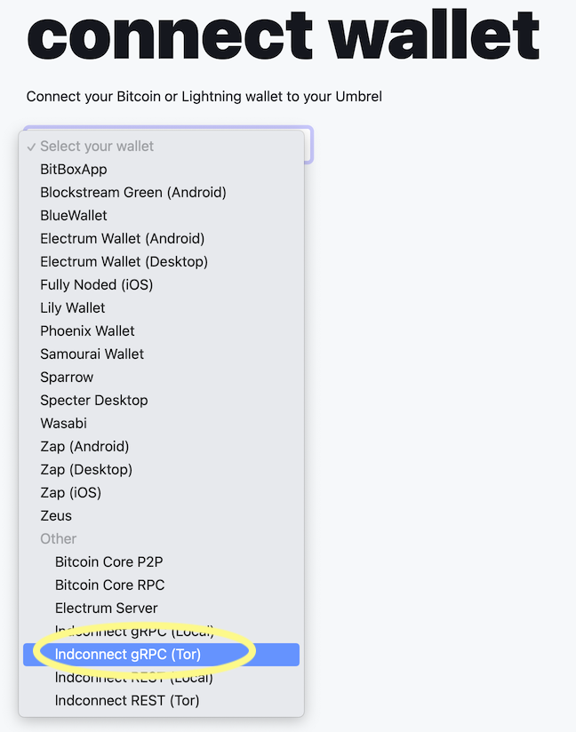
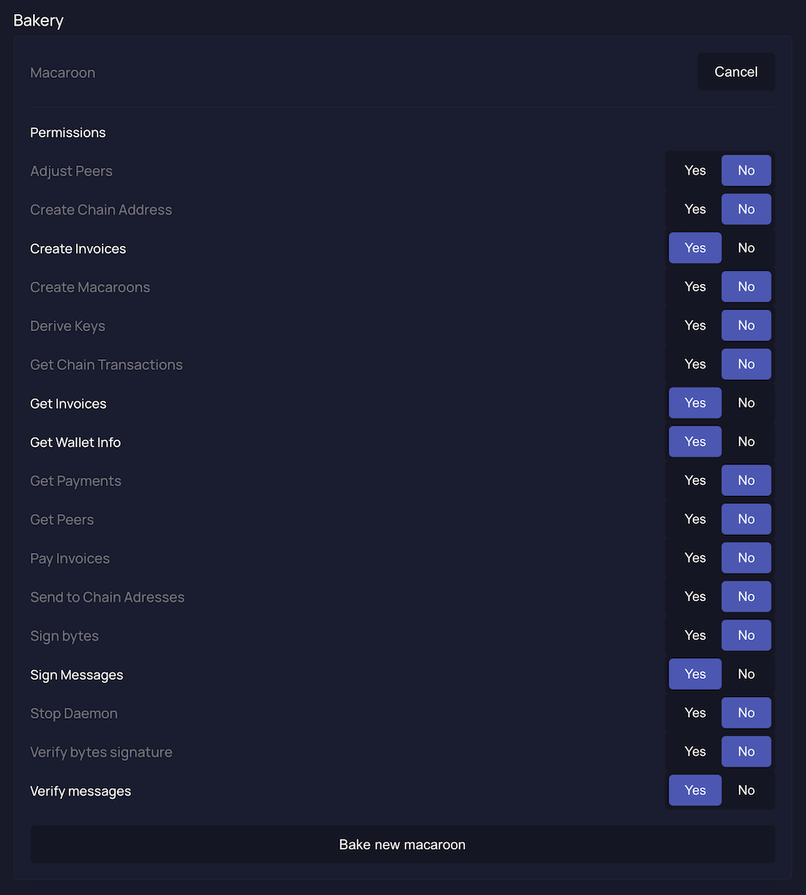

# Umbrel

## Overview

This guide will walk you through the steps required to connect your Umbrel/LND node to Wavlake. It requires a small degree of comfort with the command line and the ability to SSH into your node. We will provide code snippets where applicable to help make the process as easy as possible.

The steps below will help you to 1) identify your LND's hostname and port, 2) generate/download a tls.cert file, and 3) generate/download a custom macaroon, all of which will give Wavlake limited permissions to create and check invoices directly on your node on your behalf. We advise keeping a notepad open on your computer while walking through this guide to keep track of the items you will need to register your server.

## 1. Hostname and Port

In order to interact with your Umbrel, Wavlake needs a publicly accessible address to reach it. By default, Umbrel assigns the LND process an .onion hostname we can use for this purpose. If you have configured your LND process to be accessible via clearnet, that address or domain is OK to use, too. The most important thing is that the address stays consistent, otherwise you will have to re-register your server every time the address changes.


The .onion address we are retrieving here is not the same .onion address used to open channels with other nodes. This .onion address applies specifically to the LND Docker process that runs on your Umbrel.


To retrieve this .onion hostname, navigate to the "Connect Wallet" section on the Umbrel homepage.


Once there, open the drop down menu and select "lndconnect gRPC Tor" from the list.



On the page, you should see a URL with a long string that ends in ".onion". Copy the all the text in between the "lndconnect://" prompt and the "?" sign.

.png>)

&#x20;You should have something copied down that looks like this:

> jfdsaoj930nglamljafafklajsdkfjdskafdsa9.onion:10009

This is your LND's **hostname** (everything up to and including the .onion part) and **port** (the number part after the colon).

## 2. TLS Cert

The certificate file helps ensure that the connection between Wavlake and your Umbrel node is [relatively secure](https://docs.lightning.engineering/lightning-network-tools/lnd/safety#tls). A certificate file is automatically generated when you first start up your Umbrel and LND. However, it most likely does not contain the .onion address we will be using to connect Wavlake to your node.

In order to add the .onion host to the certificate file, we have to add one line to LND's configuration file and then restart the Umbrel so that the certificate is re-generated with the .onion hostname included.


If you have any other applications that connect to LND using the existing tls.cert file, you will have to reconfigure those applications with the new cert that we are generating here. The old cert will no longer be valid once the new one is created.


Let's start by logging in to your node. Open up a terminal on your computer and run:

```
ssh umbrel@umbrel.local
```

Most default Umbrel setups will be accessible with the above command. If you have customized your Umbrel the command will look slightly different.

When asked for your password, enter the password for your Umbrel.

Once logged in to the server, create a backup of your config file just in case something goes wrong. You will be able to reinstate this backup if needed. The following command will create a copy of the conf file called "lnd.conf-original":

```
cp umbrel/lnd/lnd.conf umbrel/lnd/lnd.conf-original
```

Now, let's open up the LND config file with a text editor:

```
nano umbrel/lnd/lnd.conf
```

You should see a file that looks like this:


In the example above, note the line that reads "tlsextradomain=umbrel.local". You most likely have the same line in your conf file. This setting adds the domain name value to the tls.cert file generated by LND, making it so that any requests to LND via that hostname match the valid hostnames listed in the cert.

Using the arrow keys on your keyboard, move the cursor to this line and add a second "tlsextradomain=" line, this time adding your .onion hostname as the value. When you're done, the section should look like this:

> tlsextradomain=umbrel.local
>
> tlsextradomain=jfdsaoj930nglamljafafklajsdkfjdskafdsa9.onion

Be sure to spell and enter everything accurately, otherwise you may have issues with LND starting and/or capturing the new configuration.

Now that the file has been modified, save and exit by pressing CTRL-X and entering "Y" when you are asked if you want to save and overwrite the existing file.


Restart your Umbrel (you can do this via the "Settings" section of the Web UI).


Once your Umbrel is up and running again, go back to your Terminal and run the following command to download the newly generated tls.cert file to your computer:

```
scp umbrel@umbrel.local:/home/umbrel/umbrel/lnd/tls.cert ./umbrel.cert
```

You will be asked for your Umbrel password again. Enter it and upon authorization your file should download to your current working directory. You can change the download path as well by modifying the path in the "./umbrel.cert" argument.

Your cert is now ready to use.


In the event something went wrong or LND won't start, double-check the conf file to see if you made any errors. In the worst case, you can reinstate the old configuration by deleting the new conf file and renaming the old one tls.cert again. Then restart.


## 3. Macaroon

The last item we need is a macaroon, which is a kind of key that allows you to perform specific actions on your LND instance. In order to give Wavlake only the minimum permissions needed to work with the site, we are going to custom "bake" a macaroon with those specific permissions only.

The simplest way to create a macaroon is by using the ThunderHub client. This is an app that is available on your Umbrel OS. If you haven't installed it already, do so now.


You can also create the macaroon via the command line if you find that easier. The command is listed at the bottom of this section.


Log into the ThunderHub client and click on the "Tools" section in the left-hand navigation pane.


On the Tools page, you should see a "Bakery" section. Click on the "Bake" button and you will see a list of options appear.

Slide the following options to "Yes" (a visual guide is below): Create Invoices, Get Invoices, Get Wallet Info, Sign Messages, Verify Messages. Then click "Bake new macaroon".



ThunderHub should display two versions of your newly baked macaroon. We want to use the "HEX" version. Copy the text for the HEX version of your macaroon and store it on your notepad.

The equivalent command line version of creating the macaroon is below:

```
lncli bakemacaroon \
uri:/lnrpc.Lightning/AddInvoice \
uri:/lnrpc.Lightning/GetInfo \
uri:/lnrpc.Lightning/LookupInvoice \
uri:/signrpc.Signer/SignMessage \
uri:/signrpc.Signer/VerifyMessage \
uri:/invoicesrpc.Invoices/SubscribeSingleInvoice
```


Because LND runs as a Docker process, you may need to prefix the above command with `docker exec -i lnd` in order for it to work properly.


## 4. Register

Now that we have all our items ready (hostname, cert, and macaroon) we can register our node with Wavlake.

Sign-up/sign-in to Wavlake and go to your Dashboard. If you have been approved to register with the site, you should see the "Add Server" button enabled. Click on it to open up the registration form.


Fill out the registration form with the information you copied from your node and the tls.cert file you downloaded. The "server nickname" field can be whatever you like.

Once everything is filled out, press "Register".


You should now see that the "Test Connection" button has been enabled on the page. Press it once to verify the connection to your node.


Once the connection has been verified, the "Add Track" button should be enabled on your dashboard. You may now begin uploading tracks!

For more information about how plays and tips work, please see the [Mechanics](../mechanics.md) page.

If you ran into any issues along the way, send us a message at contact@wavlake.com and we will try and help you out the best we can.
